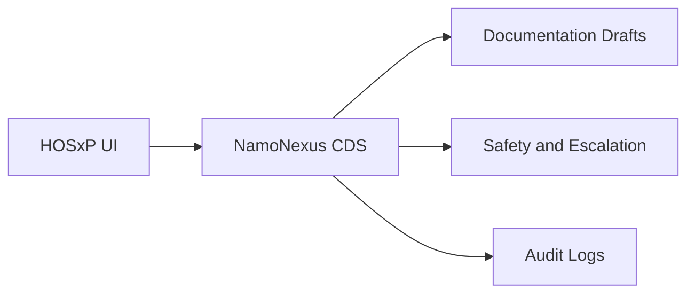

# BMS Partnership Proposal (HOSxP AI Module)

## Opportunity
Bangkok Medical Software (BMS) serves 800+ hospitals through HOSxP. There is no AI CDS module embedded in HOSxP today. NamoNexus can be positioned as a premium add-on that improves triage accuracy, documentation quality, and escalation safety.

## Value Proposition
- New revenue stream for BMS.
- Higher customer retention through differentiated CDS capability.
- Faster adoption via trusted HOSxP distribution.

## Partnership Model
| Area | Approach |
| --- | --- |
| Product | NamoNexus embedded in HOSxP UI |
| Sales | BMS sells as "AI Module" |
| Revenue share | 50-70% BMS / 30-50% NamoNexus |
| Support | Joint responsibility |

## Integration Scope
- Triage suggestions in OPD and IPD workflows.
- Documentation drafts inserted into EMR.
- Supervisor dashboard for escalation.
- Audit logs for compliance and PDPA.

## Integration Architecture (High-Level)

## Timeline
| Month | Activities | Output |
| --- | --- | --- |
| 1-2 | Scope alignment and MOU | Signed MOU |
| 3-4 | Integration design | Technical spec |
| 5-6 | Pilot (3-5 hospitals) | Pilot results |
| 6+ | Go/no-go scale decision | Rollout plan |

## Success Metrics
- Triage accuracy >= 90%.
- Documentation time reduced.
- Counselor satisfaction >= 80%.
- Safety audit passed.

## Value to BMS
- Premium add-on revenue.
- Differentiation in mental health CDS market.
- Scalable distribution via HOSxP.

## Next Steps
- Confirm revenue share terms.
- Select pilot hospitals.
- Define integration specifications and support SLAs.
