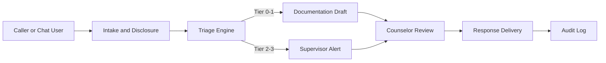

# 1323 Hotline Integration Plan: AI Triage and Documentation Assistant

## Objective
Integrate NamoNexus as a triage and documentation assistant for Thailand's 1323 mental health hotline. The system is not an autonomous crisis responder. It supports counselors by pre-triaging, drafting documentation, and escalating high-risk cases to human supervisors.

## Current Baseline (Thailand Context)
- 1323 hotline operates with limited active lines (baseline: 15).
- High repeat callers create load spikes and documentation backlog.
- Counselor time is split between direct support and documentation.
- Clinical workforce shortages limit expansion of human-only capacity.

### Feasibility Study Insights (Internal, 2024)
- Counselors report documentation time as a top operational bottleneck.
- Consistent triage improves safety outcomes and reduces escalation errors.
- Users accept AI assistance when human oversight is explicit.

## Proposed Model
NamoNexus as a Triage + Documentation Assistant
- AI screens incoming text or call transcripts to produce a triage suggestion.
- Counselor reviews and approves all responses.
- High-risk cases trigger immediate human escalation.

## Integration Touchpoints
- Call transcript ingestion from existing hotline systems.
- Dashboard embedded in counselor workstation.
- Export of escalation logs for DMH oversight.

### Capacity Impact
Target: increase effective capacity from 15 lines to 150+
- AI pre-triage reduces average handling time.
- Documentation drafts reduce post-call workload.
- Counselors can focus on direct support.

## Human Counselor Dashboard (Alert System)
Key functions:
- Risk tier alerts (Tier 2-3 immediate flags).
- Suggested responses and documentation drafts.
- Supervisor queue with SLA timers.
- Audit trail for every escalation.

### Dashboard Specification (Minimum)
- Live queue with caller status and tier.
- Escalation timer with SLA breach indicators.
- Documentation drafts with approve/edit workflow.
- Exportable audit logs for compliance review.

## Dashboard Fields (Example)
- Caller ID (pseudonymized)
- Risk tier and confidence
- Time in queue and SLA status
- Counselor notes and edits
- Escalation outcome

## Operational Workflow Diagram

## Workflow Details
1. Intake and disclosure: caller informed that AI assists triage and documentation.
2. Triage: risk scoring and tier assignment.
3. Counselor review: human approval required for all outputs.
4. Escalation: Tier 2-3 cases immediately routed to supervisors.
5. Documentation: AI drafts stored for counselor validation.

## Escalation Contact Tree
- Tier 2: supervisor on duty.
- Tier 3: supervisor + on-call clinical lead.
- Emergency: direct connection to emergency services per DMH protocol.

### Escalation SLAs (Draft)
- Tier 2: supervisor review within 15 minutes.
- Tier 3: immediate escalation and hotline handoff within 5 minutes.

## Escalation Policy Table
| Tier | Trigger | Action | Owner |
| --- | --- | --- | --- |
| 0 | Low distress | Counselor approval | Counselor |
| 1 | Elevated distress | Supervisor optional review | Counselor |
| 2 | Implicit risk | Supervisor mandatory review | Supervisor |
| 3 | Explicit risk | Immediate escalation and handoff | Supervisor |

## Capacity Model (Illustrative)
| Metric | Current Baseline | With NamoNexus CDS | Notes |
| --- | --- | --- | --- |
| Active lines | 15 | 15 | Human lines remain constant |
| Effective capacity | 15 | 150+ | Reduced handling time and async triage |
| Documentation time | High | Reduced | Drafts cut manual effort |

## Operational Policy Alignment (DMH)
- Escalation policies aligned with DMH hotline protocols.
- Clear disclaimers that CDS supports but does not replace counselors.
- Regular policy review with DMH-appointed clinical leads.

## Data Governance and PDPA
- Minimal data capture with pseudonymized identifiers.
- Consent and disclosure included at intake.
- Access logging for supervisor and auditor review.
- Retention policy defined by DMH and hotline governance.

## Data Retention Options
- 90-day retention for pilot evaluation.
- 1-year retention for clinical evidence (if approved).
- Immediate deletion on request when legally required.

## Data Handling Steps
1. Ingest transcript or chat text.
2. Apply pseudonymization before storage.
3. Store summary and audit log in secured repository.

## Reporting and Analytics
- Daily dashboard for call volume and risk tier distribution.
- Weekly safety report with escalation counts and false negatives.
- Monthly trend analysis for repeat callers and follow-up outcomes.

## Quality Review Cadence
- Weekly QA review for escalation outcomes.
- Monthly counselor feedback session.
- Quarterly policy update with DMH leadership.

## After-Action Review
- Review escalations within 24 hours for learning.
- Document improvements to scripts and policies.

## Training Requirements
| Role | Training Focus | Duration |
| --- | --- | --- |
| Counselors | Risk tier interpretation, response approval | 2 sessions |
| Supervisors | Escalation workflow and SLA handling | 2 sessions |
| IT/Ops | Dashboard usage and reporting | 1 session |

### Training Curriculum (Outline)
- Module 1: CDS model and non-autonomous boundaries.
- Module 2: Risk tier interpretation and escalation rules.
- Module 3: PDPA and consent handling.
- Module 4: Dashboard usage and audit logging.

## Counselor Workflow Details
- Counselor receives intake summary and triage suggestion.
- Counselor edits the response, approves, and logs action.
- Supervisor receives Tier 2-3 alerts with SLA timer.

## User Experience Considerations
- Clear disclosure that a human counselor reviews all outputs.
- Minimize wait time during escalation transitions.
- Provide empathetic language templates aligned with DMH guidance.

## Resource Requirements
- Supervisor coverage for Tier 2-3 escalations.
- On-call IT support during pilot window.
- Analytics support for KPI reporting.

## Staffing Assumptions (Pilot)
- 1 supervisor per 10 active counselors during peak hours.
- Dedicated data analyst for weekly KPI reporting.
- Part-time clinical lead for policy review.

## Operational Assumptions
- Hotline maintains current staffing during pilot.
- Counselors have access to the dashboard during all shifts.

## Pilot Phases
1. Phase 1: Offline simulation and tabletop exercises.
2. Phase 2: Limited pilot with manual escalation.
3. Phase 3: Scale-up with automated dashboard alerts.

## Training Schedule (Pilot)
- Week 1: counselor onboarding and disclosure training.
- Week 2: dashboard usage and escalation drills.
- Week 3: live pilot shadowing and QA review.

## Change Management
- Pre-pilot briefing for hotline leadership and counselors.
- Weekly feedback loops during pilot.
- Post-pilot evaluation and policy update.

## Public Communication Plan
- Clear public messaging that hotline remains human-led.
- Disclosure that AI assists triage and documentation only.
- FAQ for callers about PDPA and privacy.

## Public FAQ Topics
- What data is stored and for how long.
- How to request deletion of personal data.

## KPIs
- Triage accuracy vs human baseline.
- Time-to-escalation for Tier 2-3.
- Counselor workload reduction.
- User satisfaction with hotline support.

## Pilot Exit Criteria
- Triage accuracy meets pre-defined threshold.
- No unresolved severe safety incidents.
- Counselor satisfaction survey shows positive adoption.

## Escalation Audit Checklist
- Escalation logged with timestamp and reviewer.
- SLA compliance recorded.
- Follow-up actions documented.

## Triage Rubric Summary
- Tier 0: low distress, informational support only.
- Tier 1: elevated distress, coping guidance suggested.
- Tier 2: implicit risk, supervisor review required.
- Tier 3: explicit risk, immediate escalation.

## Sample Counselor Script (Disclosure)
"This service uses a decision support tool to help with triage and documentation. A human counselor reviews all responses. If you are in urgent danger, we will connect you to a counselor immediately."

## Pilot Evaluation Report (Outline)
- Call volume and wait time metrics.
- Triage accuracy and escalation outcomes.
- Counselor feedback and adoption rate.
- Recommendations for scale-up.

## Glossary
- SLA: Service level agreement for escalation timing.
- CDS: Clinical Decision Support.

## Risks and Mitigations
- Risk: Over-reliance on AI suggestions
  - Mitigation: counselor approval required for all outputs.
- Risk: Alert fatigue
  - Mitigation: calibrated thresholds and supervisor review.
- Risk: Data privacy concerns
  - Mitigation: PDPA-aligned consent and storage controls.

## References
- Feasibility Study (internal, 2024): documentation load and triage variability.
- PresScribe precedent (Looloo Health): embedded CDS improves adoption.
- Tessa failure lessons: deterministic safety guardrails and human oversight.
- Thai regulatory landscape (2024-2025): PDPA compliance requirements.

## Next Steps
- Align with DMH and hotline leadership on pilot scope.
- Finalize counselor dashboard requirements.
- Run a 4-week pilot simulation and review results.
- Prepare PDPA consent and disclosure package.

## Open Questions
- What call volume thresholds define pilot success?
- Which hotline regions should be prioritized for pilot?
