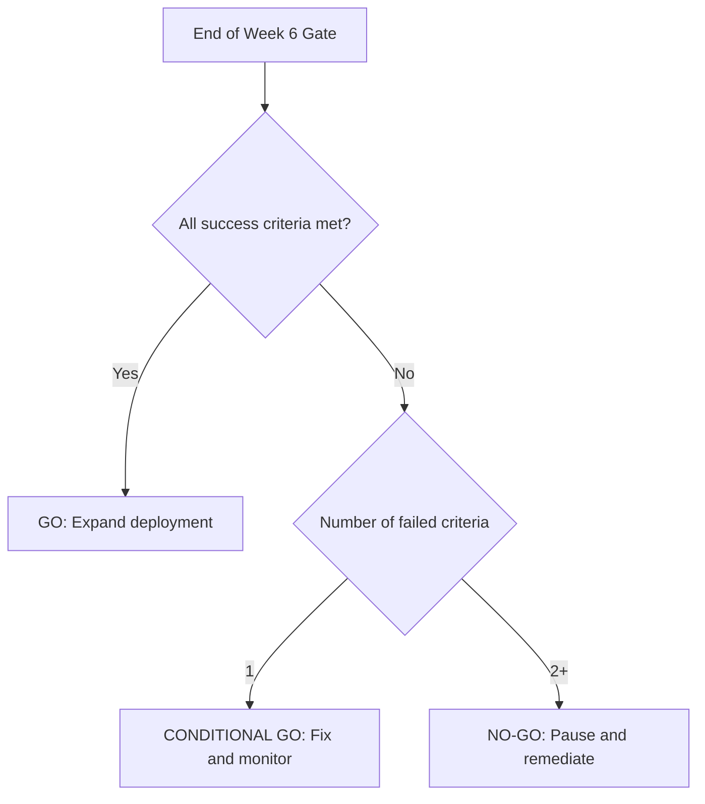

# Pilot Go/No-Go Decision Framework (Week 6)

Audience: 1323 leadership, clinical lead, IT lead, and pilot owner.

Purpose: Make a clear, accountable decision at the end of Week 6 based on predefined safety, quality, and operational thresholds.

## Decision Gate

- Gate timing: End of Week 6 (Friday decision meeting)
- Decision authority: 1323 Director (final approval)
- Default posture: Safety-first, evidence-based

## Success Criteria (ALL must pass)

- [ ] Triage accuracy >= 90%
- [ ] Safety: Zero unresolved critical incidents
- [ ] Escalation success rate = 100%
- [ ] System uptime >= 99%
- [ ] Response time < 3 sec (p95)
- [ ] Counselor adoption >= 80%
- [ ] User satisfaction >= 7/10
- [ ] PDPA audit: No findings

## Decision Tree

## Decision Outcomes

### GO (All criteria pass)

- Decision: Expand to full deployment
- Next step: Scale to 100 calls/week
- Timeline: Month 2-3
- Budget: Approved
- External signal: Ready to present to additional hospitals

### CONDITIONAL GO (1 criterion fails)

- Decision: Proceed with conditions
- Fix plan: Address failing criterion in the next phase
- Monitoring: Weekly checks until resolved
- Risk: Scale-up may be delayed
- Approval: Clinical lead + 1323 Director sign-off

### NO-GO (2+ criteria fail)

- Decision: Pause deployment
- Investigate: Root cause analysis within 5 business days
- Remedy: Fix issues, retrain, update policies
- Retry: 2-week focused pilot
- Cost impact: Additional budget required
- Timeline: Delayed 2-3 weeks

## Decision Meeting (Friday, Week 6)

- Attendees: 1323 Director, clinical lead, IT lead, pilot owner
- Duration: 60 minutes
- Format: Review data, discuss criteria, vote
- Documentation: Decision record + signatures

## Communication Plan

- If GO: Announce expansion plan to partner hospitals
- If CONDITIONAL GO: Share fix plan and revised timeline
- If NO-GO: Communicate pause + remediation roadmap
- Internal: Team debrief and learning capture within 3 days

## Required Inputs (from weekly report)

- Final Week 6 metrics summary
- Safety incident log (all resolved incidents closed)
- PDPA audit summary
- Counselor feedback survey

## Next Steps Checklist

- [ ] Confirm Week 6 dataset completeness
- [ ] Validate calculations for accuracy and uptime
- [ ] Prepare decision pack (1-page summary)
- [ ] Schedule meeting and circulate agenda
