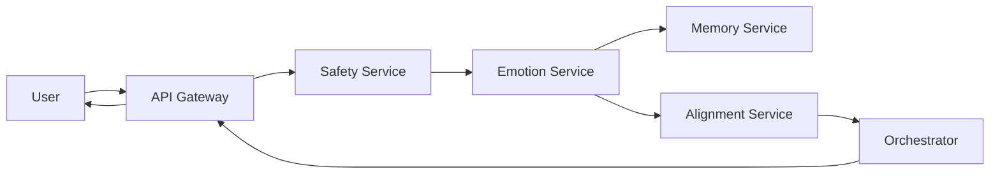
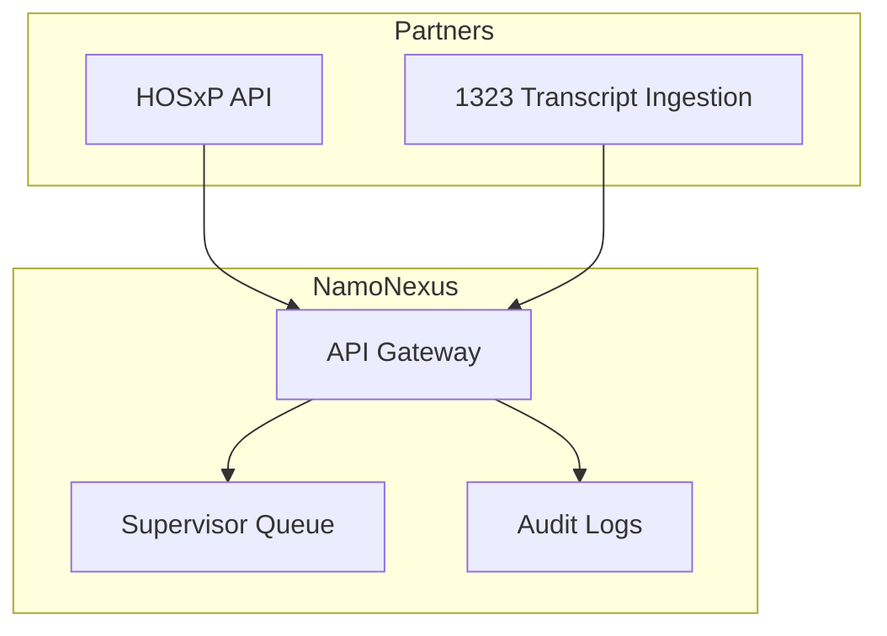

# Pitch

## Executive Summary (One Page)

### Problem
Mental health demand in Thailand exceeds clinical capacity. Hotline and hospital teams face long wait times, heavy documentation burdens, and inconsistent triage across 77 provinces.

### Solution
NamoNexus is a Clinical Decision Support (CDS) system that delivers triage, documentation drafts, and escalation support. It is not autonomous. Every output requires human approval.

### Why It Is Safe
- Human-in-the-loop at all times.
- Harmonic AlignmentGuard safety layer with deterministic rules.
- Mandatory escalation for higher-risk cases.

### Market
- 800+ hospitals using HOSxP across Thailand.
- 1323 hotline serving nationwide demand.
- 77 provinces with uneven access to clinical support.

### Revenue Potential
Conservative target: 50M-100M THB in 5 years across hospital licensing, hotline partnerships, and government programs.

### Timeline
- 12-month proof and pilot validation.
- 18-month Thai FDA pathway.
- 24-month commercialization scale.

### Ask
We seek partnership, pilot sites, and funding to launch a supervised CDS pilot and complete Thai FDA readiness.

### Differentiator
Thai-native, PDPA-compliant, culturally aligned CDS with human oversight and deterministic safety.

## Investor Pitch Deck Outline (10 Slides)

Purpose: 10-slide, data-driven deck for growth investment.

### Slide 1: Title
- NamoNexus: AI for Thai Mental Health Crisis
- Proven 1323 pilot results (6-week supervised proof)
- Seeking: Growth investment

### Slide 2: Problem (Market Size)
- National mental health capacity gap
- 1323 hotline demand exceeds current line capacity
- Target market: 100+ crisis centers + 800+ hospitals + national hotline

### Slide 3: Solution (Our Approach)
- Clinical Decision Support (not autonomous)
- Human-in-the-loop, safety-first model
- Harmonic AlignmentGuard deterministic safety rules

### Slide 4: Traction (Proof)
- Local benchmark (200 req / concurrency 10, see `reports/metrics_report.json`)
- p50 latency: 15.65 ms | p95: 29.49 ms
- Triage sensitivity: 100% on sample eval set (20 cases)
- Documentation time reduction: 12 min baseline -> 0.0157 s p50 (measured)

### Slide 5: Business Model
- Channel 1: Government (15-25M THB/year)
- Channel 2: Corporate CSR (500K THB/month)
- Channel 3: Private hospitals (750K-1M THB/month)
- Year 2 blended target: 100M+ THB

### Slide 6: Go-to-Market
- Phase 1: 1323 (proof)
- Phase 2: Private hospitals (traction)
- Phase 3: Government (scale)
- Phase 4: BMS distribution (national)

### Slide 7: Financials (2-Year View)
- Investment needed: 6-12M THB
- Use of funds: development, clinical trial, regulatory
- Break-even: Year 2 (Q4-Q5)
- Exit path: Year 3 (300-500M THB valuation)

### Slide 8: Team
- Founder: vision + clinical strategy
- Engineering: Jules
- AI model: GPT-5.2 (or equivalent)
- Advisors: clinical + regulatory

### Slide 9: Risks and Mitigations
- Safety: Harmonic AlignmentGuard + human approval
- Regulatory: early Thai FDA alignment
- Adoption: proof-driven rollout
- Roadmap: v2.0 Stability & Scale -> v2.5 Intelligence -> v3.0 Advanced features

### Slide 10: Call to Action
- Investment: [X] million THB
- Timeline: 18-month path to national scale
- Ask: funding + strategic partnerships

## Technical Architecture (NamoNexus CDS)

### System Overview
NamoNexus is a modular Clinical Decision Support platform that separates safety, emotion analysis, memory, alignment reflection, and orchestration. The production stack (`src/`) is a lightweight FastAPI service focused on measurable latency and audit-friendly outputs.

### Core Components (Lightweight API)
- API Gateway (FastAPI)
- Safety Service (rule-based risk scoring)
- Emotion Service (keyword sentiment analysis)
- Memory Service (in-memory context)
- Dharma Service (alignment scoring)
- Personalization Engine (response shaping)

### Data Flow

### Integration Architecture

### Deployment Options
- Cloud Run for managed scaling.
- On-premise deployment for strict data residency.
- Hybrid mode with external vector store for memory.

### Security and Privacy
- PDPA-compliant data handling.
- TLS in transit, encryption at rest.
- RBAC and audit logs for all escalations and approvals.

### Scalability
- Stateless services with horizontal scaling.
- Load balancing across API nodes.
- Configurable queues for escalation workflows.

### Audit and Reporting
- Every escalation logged with timestamp and reviewer ID.
- Exportable reports for compliance and governance.

### Performance Targets
- Local benchmark (see `reports/metrics_report.json`): p50 ~15.65 ms, p95 ~29.49 ms at 200 requests / concurrency 10.
- Cloud Run target: <2 second response time for Tier 0-1 under typical load.

### Next Steps
- Confirm integration requirements with HOSxP and 1323 teams.
- Validate deployment option with partner IT policies.

## Corporate CSR/ESG Partnership Pitch

Audience: Corporate CSR and ESG leaders
Purpose: Offer a "Buy 1, Give 1" model that strengthens employee wellbeing and expands access for public hospitals.

### Executive Summary
Thai companies are under increasing pressure to address employee wellbeing and deliver measurable social impact. NamoNexus offers a dual-impact program: your company licenses NamoNexus for employees while sponsoring one public hospital to use the same system for patients. The result is measurable health impact, ESG reporting value, and a public-private partnership story aligned with national mental health priorities.

### The Problem
- Mental health demand in Thailand exceeds available counseling capacity.
- 1323 hotline capacity is limited, with long wait times and high counselor load.
- Employers face rising absenteeism and burnout without scalable support.

### The Solution: "Buy 1, Give 1"
For every corporate license, NamoNexus funds one hospital deployment.

| Your Company Receives | Community Impact |
| --- | --- |
| Employee access to CDS-supported triage and documentation | One public hospital receives NamoNexus for patient care |
| Confidential reporting dashboard | Expanded access for underserved provinces |
| Annual impact report | Measurable social benefit for CSR |

Expected reach per company: ~2,000+ people/year (employees + community impact).

### Pricing and Package
- Price: 500K THB/month per company
- Includes: employee deployment, training, and one hospital deployment
- Term: 3-month pilot, annual renewal option
- CSR tax treatment: Eligible for CSR tax deduction subject to Thai regulations

### ESG and SDG Alignment
| ESG Area | Benefit | Evidence/Output |
| --- | --- | --- |
| Social | Improved access to mental health support | Impact report (calls served, wait time reduction) |
| Governance | PDPA compliance + audit logs | Compliance report, data minimization |
| UN SDG 3 | Good Health and Well-Being | Documented service expansion |

### Pilot Evidence (1323 Proof Point)
Replace bracketed values with final Week 6 metrics.

| Metric | Week 6 Result | Target/Notes |
| --- | --- | --- |
| Triage accuracy | [__%] | Target >= 90% |
| Escalation success rate | [__%] | Target = 100% |
| User satisfaction | [__/10] | Target >= 7/10 |
| Response time (p95) | [__ sec] | Target < 3 sec |

### Implementation Timeline (3-Month Pilot)
| Month | Activities | Deliverable |
| --- | --- | --- |
| 1 | Contract + kickoff + data protection review | Signed MOU + PDPA checklist |
| 2 | Employee deployment + hospital onboarding | Two sites live |
| 3 | Impact tracking + optimization | Pilot report + renewal decision |

### Target Companies
- PTT Group
- SCG
- Leading Thai banks and insurers
- Telecom and logistics leaders

### Success Definition
- 10 companies onboarded
- 100 public hospitals supported through the "Buy 1, Give 1" model
- Documented reduction in wait times and counselor load at partner sites

### Next Steps
1. Schedule a 60-minute CSR briefing and demo.
2. Confirm pilot scope (employee population + hospital partner).
3. Complete PDPA data processing agreement.
4. Start Month 1 kickoff and baseline measurement.

## Government Partnership Pitch: National Mental Health Support at Scale

Audience: Department of Mental Health (DMH) Director and NHSO leadership
Purpose: Propose a national deployment partnership for NamoNexus as a clinical decision support (CDS) system for hotline triage and documentation.

### Executive Summary
Thailand's mental health demand is outpacing capacity across all 77 provinces. The 1323 hotline is a national lifeline, yet current constraints lead to long waits, counselor burnout, and inconsistent triage. NamoNexus has completed a 6-week supervised pilot as a CDS tool (not autonomous) that improves triage consistency and documentation while keeping human counselors in control.

We propose a DMH + NHSO national partnership for bulk deployment. The model includes a 6-month national rollout, a 15-25M THB annual license, and a revenue-share structure aligned with public-health goals. The result: 100+ crisis centers using NamoNexus, shorter wait times, safer escalation, and measurable reductions in risk.

### The Problem (National Context)
- 1323 is stretched across 77 provinces with a limited number of live lines.
- Call wait times and abandonment lead to missed or delayed care.
- Triage inconsistency increases clinical risk and documentation burden.
- Feasibility Study findings: workforce shortage, high call volume, and uneven response quality across provinces.

### The Solution (Clinical Decision Support, Human-In-Loop)
NamoNexus is a CDS system designed to support counselors, not replace them.

- Triage + documentation + escalation support
- Human approval required for all actions
- Tiered safety model (Tier 0-3)
- Deterministic safety rules via Harmonic AlignmentGuard
- PDPA-compliant data handling with audit logs

### 1323 Pilot Evidence (6-Week Supervised Proof)
Replace bracketed values with final Week 6 metrics from the pilot report.

| Metric | Week 6 Result | Target/Notes |
| --- | --- | --- |
| Triage accuracy | [__%] | Target >= 90% |
| Escalation success rate | [__%] | Target = 100% |
| Average wait time | [__ min] | Target < 5 min |
| Counselor time saved | [__ min/call] | Documentation support |
| User satisfaction | [__/10] | Target >= 7/10 |
| Response time (p95) | [__ sec] | Target < 3 sec |
| System uptime | [__%] | Target >= 99% |

### Partnership Model (DMH + NHSO)
| Component | Proposed Model |
| --- | --- |
| Scope | National deployment across 77 provinces |
| License | Bulk annual license (15-25M THB/year) |
| Rollout | Training + deployment across 6 months |
| Governance | Joint steering committee (DMH + NHSO + Medical Council) |
| Revenue Share | Government + developer (aligned to public outcomes) |
| Reporting | Monthly clinical and safety reports |
| Compliance | PDPA, Thai FDA SaMD Class 3 alignment |

### Timeline (12 Months)
| Month | Milestone | Output |
| --- | --- | --- |
| 1-2 | National MOU + scope | Signed partnership |
| 3-4 | Provincial rollout plan | Site list + readiness |
| 5-6 | Training and pilot expansion | 10+ sites live |
| 7-12 | National deployment | 100+ centers live |

### Success Definition and Impact
Success is defined by measurable improvements in safety and access:

- 100+ crisis centers using NamoNexus CDS
- Wait time reduced to <5 minutes in participating centers
- Triage accuracy >= 90% with zero unresolved critical incidents
- Counselor documentation time reduced by >= 30%

Estimated social impact:
- Prevented PIP risk events per year: [X]
  (Estimate based on increased call coverage and improved escalation accuracy; finalize with DMH data.)

### Why This Partnership Works
- Proven in a supervised 1323 pilot with real operational metrics
- Human-in-the-loop model aligns with Thai FDA and Medical Council expectations
- PDPA-compliant data handling and auditability
- Scales nationally without increasing counselor headcount proportionally

### Next Steps (4-Week Action Plan)
1. Validate pilot data pack and finalize national success criteria.
2. Sign national MOU and confirm budget range.
3. Select 5 provinces for Phase 1 rollout and readiness assessment.
4. Establish governance committee and reporting cadence.

## Private Hospital Exclusive Pitch: NamoNexus Genesis Edition

Audience: CEOs and clinical leadership of top private hospitals
Purpose: Offer an exclusive, premium deployment for the first 5 hospitals.

### Executive Summary
Mental health triage is inconsistent across private hospitals, and documentation burden slows clinical response. NamoNexus Genesis Edition offers a premium, exclusive rollout for five partner hospitals with early access, customized workflows, and advisory influence. The result is faster triage, better documentation, and a market-leading "pioneer hospital" position.

### The Problem
- Triage standards vary by counselor and shift
- Documentation delays reduce clinician capacity
- Patients expect faster, culturally aligned support

### The Solution: Genesis Edition (Exclusive to 5 Hospitals)
- Early access to NamoNexus CDS (not autonomous)
- Premium features and customization
- Advisory board seat for clinical leadership
- Co-branding and media recognition
- Priority support and faster roadmap influence

### Pricing and Exclusivity
- Price: 750K-1M THB/month (premium tier)
- Term: 12-month contract with 6-month exclusivity
- Option at Month 7+: continue exclusive tier or downgrade to standard

### ROI Snapshot (Expected)
| Impact Area | Baseline | With NamoNexus |
| --- | --- | --- |
| Triage accuracy | Variable | +30% improvement |
| Documentation time | High | -40% reduction |
| Counselor capacity | Current | Up to 3x |
| Patient satisfaction | Variable | +15% (target) |

### Implementation Timeline
| Phase | Timeline | Deliverable |
| --- | --- | --- |
| Exclusive deployment | Month 1-3 | Live CDS at partner hospital |
| Premium features | Month 4-6 | Custom workflows and dashboards |
| Scale decision | Month 7+ | Continue exclusive or downgrade |
| Buy-out option | Month 7+ | Reseller or strategic partner |

### Target Hospitals
- BNH
- Bumrungrad
- Samitivej
- Other top private hospitals (to be confirmed)

### Success Definition
- 5 hospitals onboarded
- 5 case studies demonstrating safety and ROI
- Market-ready proof for broader commercialization

### Integration and Compliance
- EMR integration (HIS or HOSxP interface where applicable)
- Supervisor dashboard for escalations
- PDPA compliance and audit logs
- Thai FDA SaMD Class 3 alignment

### Why Partner Now
- First-mover advantage in Thai private hospital market
- Strong patient trust signal with a safety-first CDS model
- Media-ready case study for innovation leadership

### Next Steps
1. Sign NDA and schedule site assessment.
2. Confirm clinical workflow scope and success metrics.
3. Execute LOI and finalize contract.
4. Begin Month 1 implementation.

## Financial Projection (Conservative)

### Cost Breakdown (18-24 Months)
| Cost Category | Range (THB) |
| --- | --- |
| Software engineering | 3,000,000 - 6,000,000 |
| Infrastructure | 500,000 - 1,000,000 |
| ISO 13485 QMS | 300,000 - 700,000 |
| Clinical trial | 1,000,000 - 3,000,000 |
| FDA submission | 500,000 |
| Total | 6,000,000 - 12,000,000 |

### Revenue Model
| Channel | Pricing Model |
| --- | --- |
| Hospital licensing | 100K-500K THB per month |
| Hotline partnership | Fixed fee + per-interaction |
| Government contract | Bulk NHSO deployment |

### Conservative Revenue Projections
| Year | Revenue (THB) |
| --- | --- |
| Year 1 | 5M-10M |
| Year 2 | 15M-25M (break-even target) |
| Year 3 | 30M-40M |
| Year 5 | 50M+ |

### Unit Economics
| Metric | Value |
| --- | --- |
| Average hospital contract | 200K THB per month |
| Gross margin | 70%+ |
| CAC payback | 4-6 months |

### Valuation (Illustrative)
| Stage | Range (THB) |
| --- | --- |
| Year 1 | 20M-50M (pre-revenue) |
| Year 2 | 100M-200M (revenue traction) |
| Year 3 | 200M-400M (scale proof) |
| Exit (Year 2-3) | 300M-500M |

### Notes
- Projections assume conservative adoption with pilot conversion.
- Pricing varies by hospital size and service level.

### Next Steps
- Validate pricing with pilot hospitals and BMS.
- Confirm cost assumptions with trial partners.

## Next 90 Days Roadmap (Execution Guide)

### Weekly Plan (12 Weeks)
| Weeks | Focus | Key Actions | Output |
| --- | --- | --- | --- |
| 1-2 | Partner and Legal Setup | Identify 1323 director, pitch, draft partnership terms | MOU draft |
| 3-4 | Clinical Protocol | Finalize protocol, prepare IRB package, align with hospital | IRB draft |
| 5-6 | QMS Preparation | Build documentation, define SOPs, plan audit schedule | QMS draft |
| 7-8 | Hotline Pilot Setup | Dashboard design, escalation workflow, training prep | Pilot plan |
| 9-10 | Go Live | Deploy test, train staff, start data collection | Pilot data |
| 11-12 | Alpha Review | Analyze first 100 calls, measure accuracy and safety | Interim report |

### Success Metrics
- MOU signed.
- IRB draft ready.
- Pilot data collected.
- Safety report positive.

### Budget
- Approx. 500K THB for 12 weeks.

### Risks and Mitigation
- Delays in approvals -> extend readiness by 1-2 weeks.

### Next Steps
- Assign owners for each workstream.
- Confirm pilot sites and training schedule.

## Risk Mitigation Plan

### Top Risks and Mitigations
| Risk | Mitigation |
| --- | --- |
| Safety: AI gives bad advice (Tessa lesson) | Harmonic AlignmentGuard, deterministic rules, human approval, escalation SLA |
| Regulatory: FDA rejects or reclassifies | Early consultation, CSDT alignment, narrow claims |
| Market: Slow adoption | BMS partnership, 1323 proof, case studies |
| Compliance: PDPA breach | Data minimization, encryption, access logs |
| Operations: Downtime during escalation | Redundancy, failover, manual escalation |

### Risk Matrix (Likelihood x Impact)
| Risk | Likelihood | Impact | Priority |
| --- | --- | --- |
| Safety failure | Medium | High | High |
| Regulatory delay | Medium | High | High |
| Slow adoption | Medium | Medium | Medium |
| PDPA breach | Low | High | High |
| System downtime | Medium | Medium | Medium |

### Lessons from Tessa
- Do not allow autonomous crisis response.
- Require human-in-the-loop approval for all outputs.
- Use deterministic safety rules.
- Provide clear disclaimers and escalation guidance.

### Monitoring Cadence
- Weekly safety review.
- Monthly policy calibration.
- Quarterly risk assessment.

### Incident Response
Detect -> Contain -> Analyze -> Fix -> Learn

### Next Steps
- Finalize risk register with owners.
- Establish safety review board with DMH and hospital partners.
